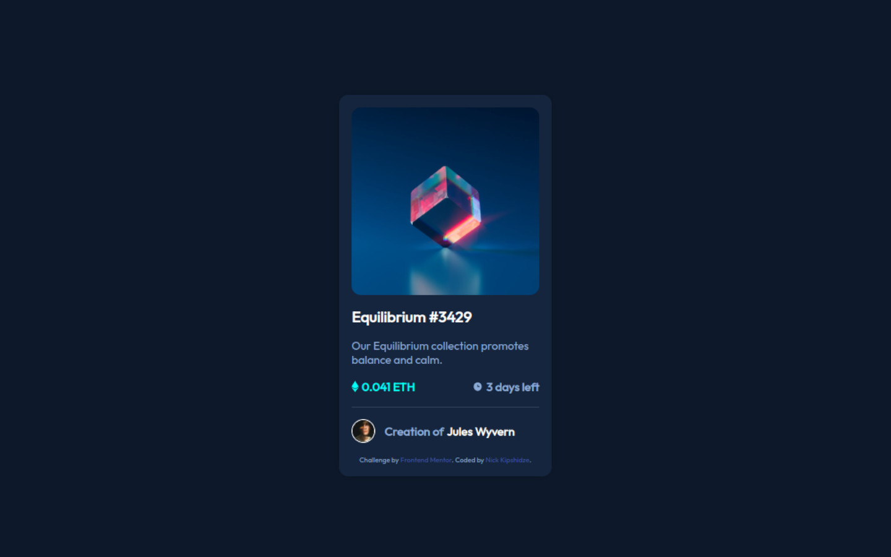

# Frontend Mentor - NFT preview card component solution

This is a solution to the [NFT preview card component challenge on Frontend Mentor](https://www.frontendmentor.io/challenges/nft-preview-card-component-SbdUL_w0U). Frontend Mentor challenges help you improve your coding skills by building realistic projects. 

## Table of contents

- [Overview](#overview)
  - [The challenge](#the-challenge)
  - [Screenshot](#screenshot)
- [My process](#my-process)
  - [Built with](#built-with)
  - [What I learned](#what-i-learned)
  - [Continued development](#continued-development)
  - [Useful resources](#useful-resources)
- [Author](#author)

## Overview

### The challenge

Users should be able to:

- View the optimal layout depending on their device's screen size
- See hover states for interactive elements

### Screenshot



## My process
- Roughly plan the HTML structure
- Prepare the HTML
- Prepare color variables according to style guide
- Create reusable classes
- Add styles to the HTML

### Built with

- Semantic HTML5 markup
- CSS custom properties
- Flexbox

### What I learned

You can open another page when an element is clicked using onclick property and some JavaScript:

```HTML
<div onclick="window.open('./images/image-equilibrium.jpg')">
  Click me to view the image
</div>
```

### Continued development

I will definetly continue writing reusable classes.

### Useful resources

- [tutorialrepublic.com](https://www.tutorialrepublic.com/faq/how-to-change-the-color-of-an-hr-element-using-css.php) - Borrowed markup to change the color of hr tag.

## Author

- GitHub - [NickKipshidze](https://github.com/NickKipshidze)
- Frontend Mentor - [@NickKipshidze](https://www.frontendmentor.io/profile/NickKipshidze)