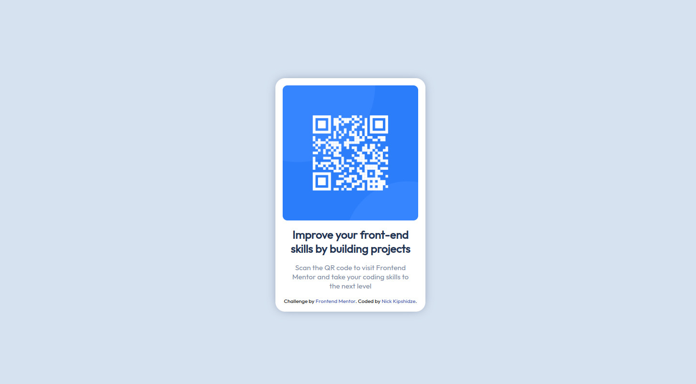

# Frontend Mentor - QR code component solution

This is a solution to the [QR code component challenge on Frontend Mentor](https://www.frontendmentor.io/challenges/qr-code-component-iux_sIO_H). Frontend Mentor challenges help you improve your coding skills by building realistic projects. 

## Table of contents

- [Overview](#overview)
  - [Screenshot](#screenshot)
- [My process](#my-process)
  - [Built with](#built-with)
  - [What I learned](#what-i-learned)
  - [Useful resources](#useful-resources)
- [Author](#author)

## Overview

### Screenshot



## My process
- Prepared the HTML markup
- Created color variables accodring to style guide
- Styled the elements by trial and error

### Built with

- Semantic HTML5 markup
- CSS custom properties
- Flexbox

### What I learned

I learned that you can easily import fonts from google by importing the API link in your CSS:

```css
@import url("https://fonts.googleapis.com/css?family=Outfit&display=swap");
```

### Useful resources

- [w3docs](https://www.w3docs.com/snippets/css/how-to-import-google-fonts-in-css-file.html) - This helped me for setting up custom fonts in CSS. I really liked this pattern and will use it going forward.

## Author

- GitHub - [Nick Kipshidze](https://github.com/NickKipshidze)
- Frontend Mentor - [@NickKipshidze](https://www.frontendmentor.io/profile/NickKipshidze)